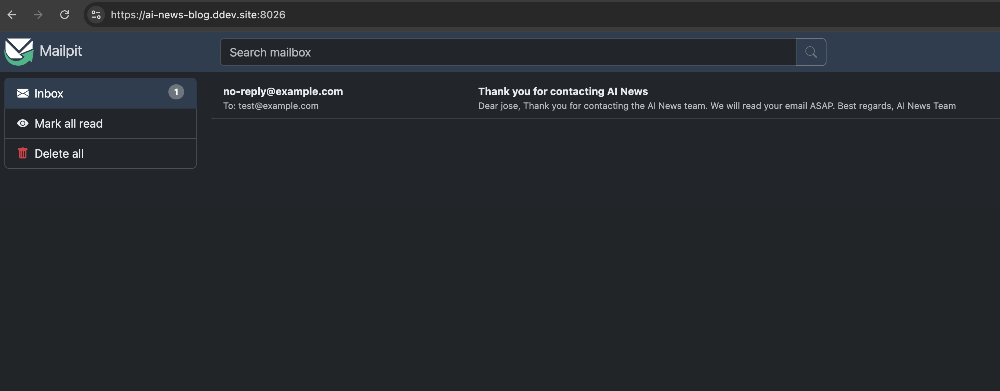

# AI News Blog

## WIP

## Overview

Welcome to **AI News**, a blog dedicated to sharing the latest news and insights on Artificial Intelligence. This blog is built using **HTML**, **Vanilla JavaScript**, and **PHP** for the backend.

## Setting Up the Project with DDEV

The DDEV configuration is already included in the project repository, so you can start the development environment quickly.

### Prerequisites

1. **Install Docker**

   DDEV relies on Docker to create isolated development environments.

   - **For Windows and macOS**: Download and install Docker Desktop from [Docker's official website](https://docs.docker.com/get-docker/).
   - **For Linux**: Install Docker Engine by following the instructions specific to your distribution on [Docker's official website](https://docs.docker.com/engine/install/).

2. **Install DDEV**

   After installing Docker, proceed to install DDEV. See [DDEV Installation Guide](https://ddev.readthedocs.io/en/stable/users/install/ddev-installation).

   After installation, verify that DDEV is installed correctly:

   ```bash
   ddev version
   ```

## Running the AI News Blog Project

Since the DDEV project configuration is already set up in the repository, you can quickly start the development environment.

1. **Clone the Project Repository**

   Open your terminal or command prompt and clone the project repository:

   ```bash
   git clone https://github.com/jmrvuax/ai-news-blog.git
   ```

   Navigate into the project directory:

   ```bash
   cd ai-news-blog
   ```

2. **Start the DDEV Environment**

   Since the DDEV configuration is already set up, simply start the DDEV environment:

   ```bash
   ddev start
   ```

3. **Access the Project**

   After starting, DDEV provides a local URL to access your project. Typically, it's:

   ```
   https://ai-news-blog.ddev.site
   ```

   Open this URL in your web browser to view your project.

4. **Using Mailpit with DDEV**

   After your project is started, you can access the Mailpit web interface at:

   ```
   https://ai-news-blog.ddev.site:8026
   ```

   Alternatively, you can launch Mailpit directly in your default browser by running:

   ```bash
   ddev mailpit
   ```

   **Mailpit Interface Screenshot:**

   

5. **Stop the DDEV Environment**

   When you're done working, stop the DDEV environment to free up system resources:

   ```bash
   ddev stop
   ```

By following these steps, you can easily set up and run the AI News Blog project using DDEV, leveraging the existing configuration in the repository.
